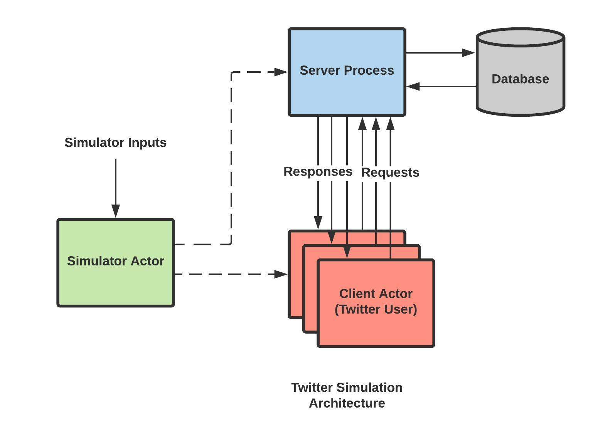

# Twitter Clone and a client tester/simulator using F# and Akka.net Actors

#### Objective

The goal of this first part of a two part project is to implement the user/engine interaction and test it
using a simulator built over it. It is supposed to be a twitter clone with functionalities that mimic the real social networking service. This is implemented using the concurrent programming model of
F# [1], Akka Actors[2].

#### Architecture

The porject has four main parts:
* The Simulator:
	* This module is a Akka actor that takes 3 command line inputs:
        * n : Number of users
        * maxSubs : Maximum number of subscribers a user
        * maxTwts : Maximum number of Tweets a user
* The Client:
	* This module is a Akka actor that mimics the functionality of logged in application provided to the user by the service. For example Twitter for Web/Android.
* The Sever:
	* This is the component that forms the communication bridge between various signed-up users. All the tweets, follow notifications etc. crossover from one user to the another via the server as the mediator.
* The Database:
	* This component that store all the data related to hashtags, tweets and users and also procedures to perform while modfiying/adding them(reduces load off server).

#### Functionalities
We Provide the following functionalities:
* Signup for a new user
* Login/Logout for an existing user
* Follow for existing users from A to B
* Tweet/Retweet by an existing user
* Support for using hastags in tweets and retweets
* Support for Live Updates, if a user is logged in, on:
    * Tweets by users they follow
    * Tweets that have been mentioned in
* Support for quering tweets by an existing user on the basis of:
	* Tweets they made
	* Tweets by hashtags
	* Tweets by users they follow
	* Tweets that have been mentioned in
* Population of an users timeline and mentions by leveraging the above functionality

#### Modules
The above functionalities are provided through an intricate interplay of the modules, which are:

#### Observations

The above table and graph show how much time was taken for each user to receive a copy of a tweet on
its logged in client. Note that each user other than the one tweeting was subscribed to receive tweet. We
would also like to mention that, after the 5000 users mark, the CPU of the machine started to throttle
due to heat and hence the results after that are not on the same processor clock speed. This was tested
on an Intel i7-8750H hex core CPU.

#### Zipf Distribution of followers
In this project we have simulated a Zipf distribution of followers. The simulation has been done based on the number of followers/subscribers for all active users. We take the maximum subscribers a user can have as an input parameter and the user with most number of followers are simulated to have those many number of subscribers, and the user with the second most number of followers had maximum subscribers/2 and the user which is third in rank having maximum subscribers/3 and so on. This has been implemented using a reduce algorithm and accumulators.

#### Results
Even though we were able to host a maximum of 100,000 users on the test machine, we are certain that
this engine can easily do more due to its highly distributive nature, even within the engine. This Engine
provides a layered architecture which finally exposes a top layer API to host a twitter like engine along
with compatible clients.

#### Dependencies
* Akka.Cluster~>1.4.10
* Akka.FSharp~>1.4.12
* Akka.Remote~>1.4.12
* Akka.TestKit~>1.4.12
* MathNet.Numerics~>4.12.0

#### Tested and Dvelopend on OS
* GNU/Linux,Windows

#### References
[1] [F#](https://fsharp.org/docs/)
[2] [Akka.net](https://getakka.net/articles/intro/what-is-akka.html)

